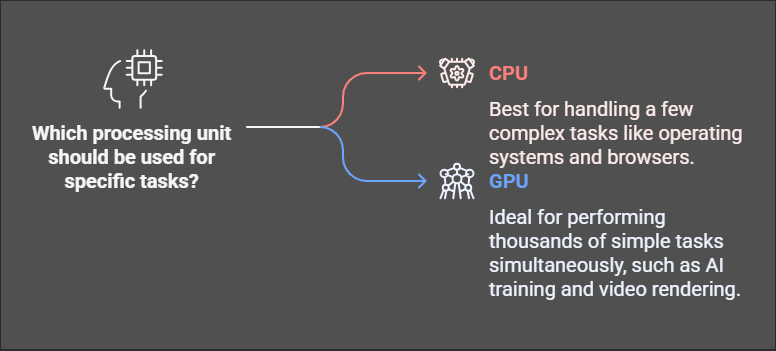

# Day 1: Introduction to CUDA

## 1. Overview & Objectives

### What I Learned Today:
Today was my first proper dive into CUDA, and honestly, at first, it felt a bit confusing but also exciting. While writing this note, I started connecting the dots, and it really opened my eyes. Before this, I used to think GPUs were just for gaming or AI model training, but I never really thought about **how** they process data so fast. Now, I understand that GPUs have this incredible ability to handle thousands of tasks at once, making them super powerful for all kinds of computing tasks. 

This learning experience gave me a strong foundation on what CUDA is, how it works, and why it's such a **big deal** in high-performance computing.

### Key Takeaways:
- **CUDA Defined:** It’s NVIDIA’s parallel computing platform that lets GPUs do more than just graphics.
- **CPU vs. GPU:** CPUs handle tasks one by one, but GPUs can process many tasks at the same time, making them perfect for parallel computing.
- **CUDA Architecture:** The concept of **threads, blocks, and grids** makes it possible to run computations efficiently on GPUs.

---

## 2. What is CUDA?

I always thought of GPUs as just fancy hardware for gaming, but today I discovered CUDA – **NVIDIA’s Compute Unified Device Architecture**. Simply put, CUDA lets us use GPUs for general-purpose tasks beyond graphics.

### Why is this exciting?
- It enables **General-Purpose GPU (GPGPU) computing**, meaning GPUs can be used for AI, scientific simulations, and big data processing.
- CUDA is widely used in deep learning, real-time rendering, and high-performance computing.

---

## 3. GPU vs. CPU: What’s the Difference?

Before today, I knew CPUs were used for general tasks, but now I understand why GPUs are **so much faster** for certain types of workloads.

### CPU (Central Processing Unit):
- **Good at:** Handling a few complex tasks at a time.
- **Cores:** Usually 4 to 16 powerful cores.
- **Best for:** Running operating systems, browsers, and general software.

### GPU (Graphics Processing Unit):
- **Good at:** Doing thousands of simple tasks **at the same time**.
- **Cores:** Thousands of smaller, efficient cores.
- **Best for:** AI training, video rendering, and physics simulations.

### The Big Takeaway:
If a task involves repeating the same operation across lots of data (like image processing or deep learning), a **GPU will be way faster** than a CPU.

---

## 4. CUDA Architecture: Breaking It Down

CUDA makes parallel computing easier by organizing execution in a structured way.

### Core Concepts:
- **Kernels:** Functions that run on the GPU and execute many times in parallel.
- **Threads, Blocks, and Grids:**
  - **Threads:** Smallest unit of execution.
  - **Blocks:** Groups of threads that work together.
  - **Grids:** Collections of blocks that manage large-scale parallel execution.

### Execution Model:
- CUDA programs run on the **CPU (host)** but execute kernels on the **GPU (device)**.
- The GPU processes data using a **hierarchical structure** of threads → blocks → grids.

### GPU Memory Hierarchy:
One of the coolest things I learned was how GPUs **manage memory efficiently**:
- **Global memory:** Accessible by all threads, but slow.
- **Shared memory:** Faster, used for communication between threads in a block.
- **Registers:** Super-fast but limited.
- **Constant memory:** Optimized for repeated access.

---

## 5. Why Should I Learn CUDA?

After today, I totally get why CUDA is such a **game-changer** for computing. 

### **Why CUDA is Awesome:**
- CPUs struggle with massive workloads, but **GPUs thrive on them**.
- CUDA lets us **speed up computations massively** by using parallelism.

### **Where It's Used:**
- **AI & Machine Learning:** CUDA speeds up deep learning training in **TensorFlow and PyTorch**.
- **Gaming & Graphics:** Used for **real-time rendering and physics simulations**.
- **Scientific Computing:** Helps with complex **simulations and big data analysis**.

---

## 6. Suggested Exercises & Self-Study

### Research Questions:
#### **When was CUDA introduced, and why did NVIDIA create it?**
- **CUDA Introduction:**  
   CUDA was introduced by NVIDIA in 2006 and released in 2007. Initially, it was called Compute Unified Device Architecture.
- **Why Created:**  
   NVIDIA designed CUDA to utilize GPUs for more than just graphics. Their goal was to harness the massive parallel processing power of GPUs for science, data processing, and AI applications.

#### **How has GPU computing changed over the years?**
- **Early Days (1990s-2000s):** GPUs were mainly used for 3D graphics in gaming.
- **Programmable GPUs (Early 2000s):** GPUs became more flexible and could handle more than just graphics.
- **CUDA (2006):** NVIDIA introduced CUDA, enabling GPUs to perform complex computations for science and data analysis.
- **AI and Deep Learning (Late 2000s Onwards):** GPUs became essential for training AI models due to their high-speed parallel processing.
- **Today:** GPUs are widely used in AI, cloud computing, and high-performance computing, continuously evolving with technologies like ray tracing and neural graphics.

#### **Breakthroughs Made Possible by CUDA**
- **HIV Research:** CUDA helped scientists understand the HIV virus, leading to new medicine possibilities.
- **SETI@Home:** Accelerated the search for extraterrestrial life by processing massive datasets quickly.
- **Weather Forecasting:** Improved climate simulations, making predictions more accurate.
- **AI and Deep Learning:** Advanced neural networks, aiding in fields like drug discovery.
- **Quantum Computing:** CUDA helps simulate quantum computers, paving the way for revolutionary computing techniques.

### Hands-on Reading:
- Read the first few chapters of *Programming Massively Parallel Processors* to understand CUDA’s foundations.

### Reflection:
- **What real-world problems can parallel computing solve?**
  - **Weather Forecasting:** Helps make predictions more accurate.
  - **AI Acceleration:** Speeds up training and inference of AI models.
  - **Big Data Processing:** Analyzing massive datasets efficiently.
  - **Medical Imaging:** Helps doctors analyze images quickly for diagnosis.

- **How will CUDA impact AI and high-performance computing?**
  - **AI models will become faster and more efficient.**
  - **Supercomputers will perform better in simulations and big data analysis.**
  - **CUDA might integrate with quantum computing for advanced problem-solving.**
  - **Future GPUs will focus on energy efficiency while keeping high performance.**

---

## 7. Real-World Applications

### AI & Deep Learning:
- CUDA powers deep learning by **speeding up matrix computations**.
- Training AI models on GPUs is **up to 100x faster** than on CPUs.

### Gaming:
- Real-time rendering, AI behavior, and physics simulations **all use CUDA**.

---
### Final Thoughts
Today was a huge learning experience! I now understand why **parallel computing is such a game-changer** and how **GPUs can revolutionize performance in AI, gaming, and scientific computing.** Tomorrow, I’m diving into the hands-on part and setting up CUDA on my system. Excited to start coding! 🚀
